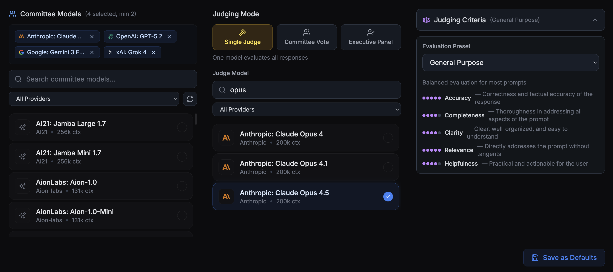

# Consensus

An AI model comparison tool that submits prompts to multiple LLMs simultaneously, streams responses in real-time, and evaluates them with configurable judge models.


## Features

- **Multi-model prompting**: Query multiple AI models in parallel via OpenRouter
- **Real-time streaming**: See responses as they're generated using SSE
- **Flexible judging**: Single judge, committee voting, or executive panel modes
- **Customizable criteria**: Define evaluation criteria for response comparison
- **Session history**: Persist and revisit past comparisons
- **Model management**: Save default committee configurations



## Tech Stack

- **Next.js 15** (App Router) + **React 19**
- **Convex** for real-time database and backend
- **Clerk** for authentication
- **OpenRouter** for multi-provider LLM access
- **Tailwind CSS** for styling
- **TypeScript** in strict mode

## Getting Started

### Prerequisites

- Node.js 18+
- [Convex account](https://convex.dev) (free tier available)
- [OpenRouter API key](https://openrouter.ai)
- [Clerk account](https://clerk.com) for authentication

### Installation

```bash
git clone https://github.com/lcondliffe/Consensus.git
cd Consensus
npm install
```

### Environment Variables

Create `.env.local`:

```bash
OPENROUTER_API_KEY=your_openrouter_key
NEXT_PUBLIC_CONVEX_URL=your_convex_url
NEXT_PUBLIC_CLERK_PUBLISHABLE_KEY=your_clerk_publishable_key
CLERK_SECRET_KEY=your_clerk_secret_key
NEXT_PUBLIC_CLERK_SIGN_IN_URL=/sign-in
NEXT_PUBLIC_CLERK_SIGN_UP_URL=/sign-up
```

### Running Locally

```bash
# Terminal 1: Start Convex backend
npx convex dev

# Terminal 2: Start Next.js dev server
npm run dev
```

Visit `http://localhost:3000`

## Project Structure

```
src/
├── app/
│   ├── api/
│   │   ├── committee/    # Parallel model streaming endpoint
│   │   ├── judge/        # Response evaluation endpoint
│   │   └── models/       # OpenRouter model listing
│   ├── page.tsx          # Main app (prompt input, responses, verdict)
│   └── layout.tsx        # Root layout with providers
├── components/           # UI components (ModelPicker, ResponsePanel, etc.)
└── lib/
    ├── types.ts          # Core TypeScript interfaces
    └── criteria.ts       # Evaluation criteria presets

convex/
├── schema.ts             # Database schema
├── sessions.ts           # Session persistence mutations/queries
└── userPreferences.ts    # User settings storage
```

## Architecture

```
User submits prompt
       ↓
POST /api/committee → OpenRouter (parallel requests)
       ↓
SSE stream responses to client
       ↓
POST /api/judge → Evaluate responses
       ↓
Convex mutations persist session
```

### Judging Modes

- **Single Judge**: One model (default: Claude Sonnet 4) evaluates all responses
- **Committee**: All responding models evaluate each other (excluding their own)
- **Executive**: User-selected subset of models act as judges

## Development

```bash
npm run dev          # Start Next.js dev server
npm run build        # Build for production
npm run lint         # ESLint check (required before commit)
npm run typecheck    # TypeScript check (required before commit)
npx convex dev       # Start Convex backend
npx convex deploy    # Deploy Convex to production
```

## Deployment

1. Deploy Convex: `npx convex deploy`
2. Deploy to Vercel (or similar) with environment variables configured

## License

MIT
